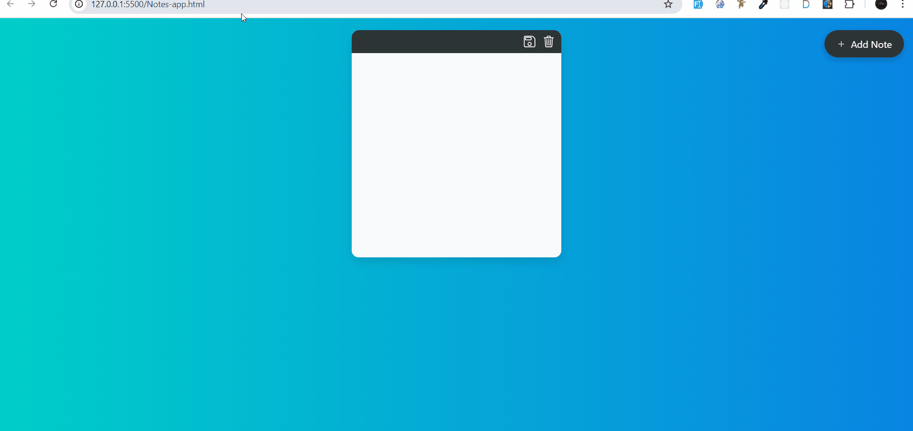

 # 📒 Notes App

A simple and stylish Notes App built with HTML, CSS, and JavaScript.
It allows you to create, save, and delete notes directly in the browser using localStorage.

---

🚀 Features

✏️ Add Notes – Create unlimited notes with one click

💾 Save Notes – Save your notes in localStorage (data persists after refresh)

🗑️ Delete Notes – Remove notes instantly

🌈 Modern UI – Clean & responsive design with hover effects

⚡ Auto Load – Loads your saved notes automatically when the app is reopened

---

🛠️ Tech Stack

HTML5

CSS3

JavaScript (Vanilla JS)

LocalStorage

---

🎥 Demo

---

📌 How It Works

Click on Add Note button ➕ to create a new note.

Write text inside the note.

Click the Save icon 💾 to save notes in your browser.

Click the Trash icon 🗑️ to delete notes.

All saved notes stay even after refreshing the page.

---

 🧑‍💻 Developer

Developed by Asim Mir  
[GitHub: asim249](https://github.com/asim249)

